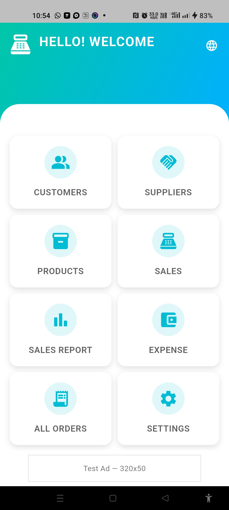
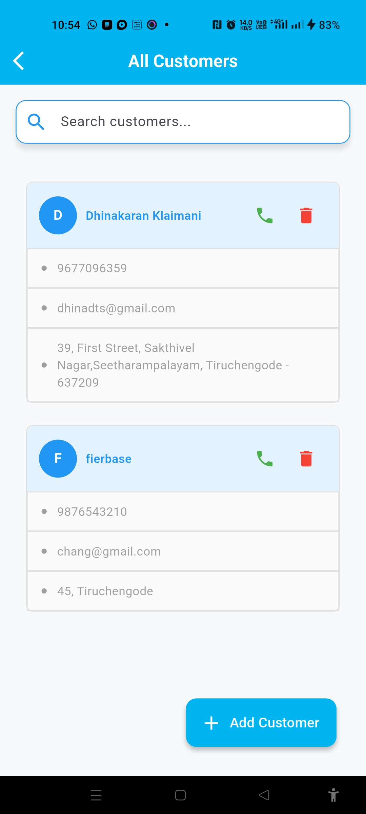
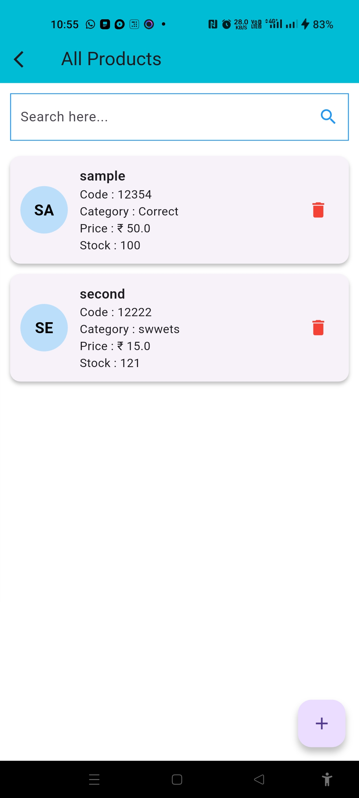
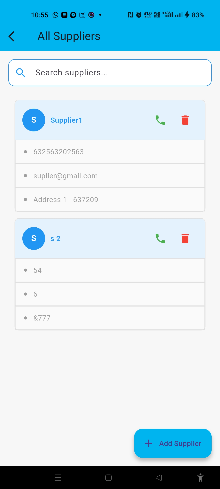
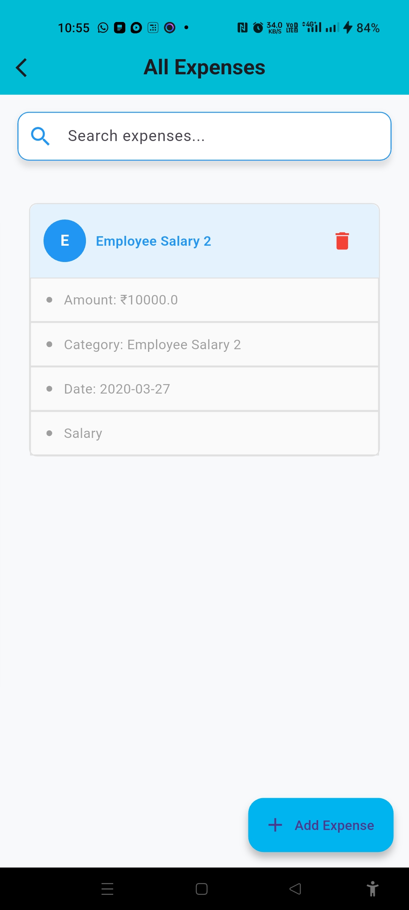
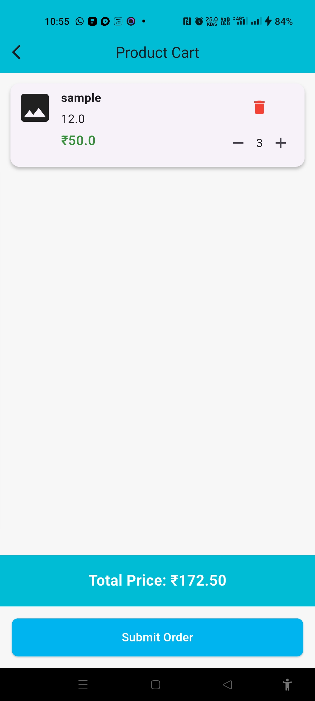
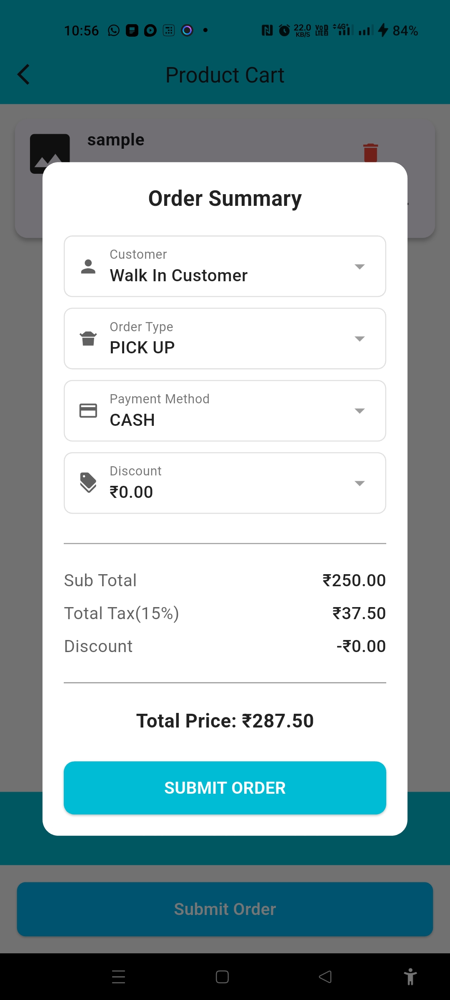
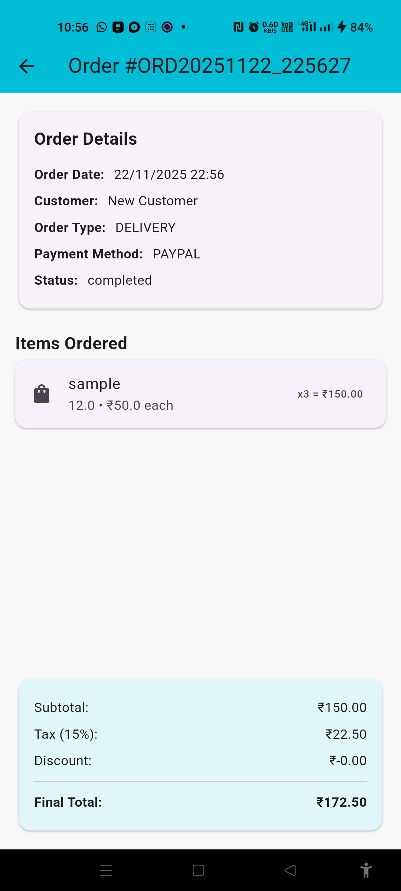
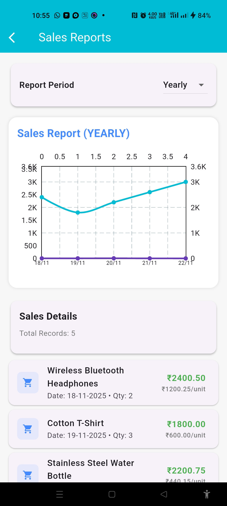

# 🚀 POI AI Sales Insight  
A Modern, Multi-Platform POS System with AI-Driven Business Insights


---

## 📄 **Overview**
**POI AI Sales Insight** is a modern, AI-assisted Point-of-Sale application built using **Flutter**.  
It integrates real-time sales tracking, inventory monitoring, customer management, and AI-powered insights to help businesses make smarter decisions.

Designed for **Android**, **Web**, and **Desktop**, the app offers a unified POS experience with seamless Firebase sync and offline-first architecture.

---

## ✨ **Key Features**

### 🛒 **1. POS Billing System**
- Fast and intuitive billing UI  
- Add/remove items, quantity update, discounts  
- Automatic tax + total calculation  
- Multi-device responsive layout  

### 📊 **2. Sales Analytics & Reports**
- Daily/Weekly/Monthly Sales Graphs using **FL Chart**  
- Top selling products  
- Gross revenue / profit tracking  
- Export reports  

### 🧾 **3. Thermal Printer Support**
- 58mm / 80mm thermal printer  
- Bluetooth / USB / Network Printer  
- Print invoices, receipts, and reports  

### 👨‍💼 **4. Customer Management**
- Add & manage customers  
- Track purchase history  
- Customer credit / balance tracking  

### 📦 **5. Product & Inventory Management**
- Add / update products  
- Real-time stock tracking  
- Barcode support  
- Image upload with Firebase Storage  

### ☁️ **6. Cloud Sync with Firebase**
- Real-time sync using **Firestore**  
- Firebase Authentication  
- Cloud Storage for product images  

### 📴 **7. Offline Mode**
- App works even without internet  
- Automatically syncs when online  

### 🖥️ **8. Multi-Platform Support**
| Platform | Supported |
|---------|-----------|
| Android | ✔️ |
| Web     | ✔️ |
| Windows | ✔️ |
| Linux   | ✔️ |
| macOS   | ✔️ |

---

## 🛠️ **Tech Stack**

### **Frontend**
- Flutter 3.x
- Riverpod (State Management)
- Go Router (Navigation)
- Material 3 UI + Responsive Layout

### **Backend**
- Firebase Authentication  
- Cloud Firestore  
- Firebase Storage  

### **Libraries**
- FL Chart (Analytics)  
- Printing / ESC POS  
- Freezed / JSON Serializable  
- intl  
- Http / Dio  

---

## 📁 **Project Structure (Feature-Based Architecture)**
---
lib/
├── core/
| ├── db/
│ ├── firebase/
│ ├── utils/
│ └── widgets/
├── features/
│ ├── auth/
│ ├── presentation/
│   ├── products/
|   ├── customers/
│   ├── orders/
│   ├── reports/
|   ├── suppliers
│   └── sales/
├── app.dart
└── main.dart


---

## 🧑‍🔧 **Installation Guide**

### 🔹 **1. Clone the Repository**
```
git clone https://github.com/your-repo/poi-ai-sales-insight.git

cd poi-ai-sales-insight
```

### 🔹 **2. Install Dependencies**
```
flutter pub get
```

### 🔹 **3. Add Firebase Configuration**
Add your Firebase files:

- `google-services.json` → `android/app/`
- `GoogleService-Info.plist` → `ios/Runner/`
- `firebase_options.dart` using FlutterFire CLI

### 🔹 **4. Run the App**
```
flutter run
```

### 🔹 **5. Build for Web**
```
flutter build web
```

---

## 🏗️ **Architecture Diagram**

            ┌─────────────────────┐
            │     Presentation     │
            │  (UI + Widgets)      │
            └─────────┬───────────┘
                      │
            ┌─────────────────────┐
            │   State Management   │
            │      Riverpod        │
            └─────────┬───────────┘
                      │
            ┌─────────────────────┐
            │     Repository       │
            │ (Business Logic)     │
            └─────────┬───────────┘
                      │
            ┌─────────────────────┐
            │     Data Layer       │
            │ Firebase / Local DB  │
            └─────────────────────┘

---

## 🖼️ **Screenshots**

---

## 📱 Screenshots

<p align="center">
  
  
  
  
  

</p>

<p align="center">
  
  
  
  
  
  
  
</p>

---


---

## 🚀 **Roadmap**

### 👍 Completed
- POS Billing System  
- Firebase Cloud Sync  
- Thermal Printing  
- Product Catalog & Inventory  
- Sales Analytics  

### 🔜 Upcoming
- AI-powered product recommendation  
- GPT-based sales forecasting  
- Multi-language support  
- Role-based Access (Admin / Staff)  
- Multi-branch support  

---

## 📝 **License**

This project is licensed under the **MIT License**.

---

## 🏢 **Developed By**
### **DHINAKARAN K*  
✔️ Web & Mobile Application Development  
✔️ AI Solutions for Enterprises  
✔️ POS & ERP Solutions  

---

## 💬 **Support**

For queries or custom development:  
📧 **dhinadts@gmail.com**    
📱 +91 96770 96359  

---

If you want, I can also generate:

✅ CONTRIBUTING.md  
✅ CODE_OF_CONDUCT.md  
✅ API Documentation  
✅ Folder Structure Diagram  
✅ App Icons + Branding  

Just tell me!
